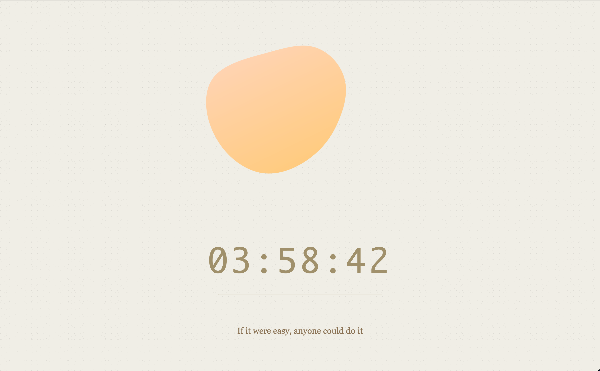

# ZeroDistraction - Firefox Extension

Stay focused and avoid distractions.
A Firefox extension that blocks distracting websites for a selected time.

## Why ZeroDistraction?

You sit down to work on something important.
You open your browser and tell yourself "just one quick check" on HackerNews or YouTube.
Three hours later, you're still scrolling, and that important task remains untouched.
We've all been there.
The internet is designed to capture and hold your attention.

**ZeroDistraction puts you back in control.**
When you need to focus, activate it for a set time period.
Try to visit a distracting site, and instead of endless feeds, you see a simple timer counting down.
It's about creating intentional breaks from distraction when you need to get things done.

## How does it work?

* Set a focus timer for your desired duration
* Distracting websites are automatically blocked during the timer
* Ships with categorized presets (social media, news, entertainment) to block
* Blocked sites show a simple countdown instead of their content
* Configure an allowlist of URLs that remain accessible even during focus sessions
* Timer runs in the background - no need to keep the extension popup open

## Similar Extensions

* [**LeechBlockNG**](https://addons.mozilla.org/en-US/firefox/addon/leechblock-ng/): Very mature, feature-rich and customizable extension.
  * **What kept me from using it?** I wanted something simpler, cleaner and without the need for extensive configuration.
  I don't want to bother reading through long documentation and spend half a day just to get started.
  I just want to select a time period and get started - easy as that.

## Privacy and Data Protection

ZeroDistraction respects your privacy and protects your data:

**Why does the extension need permissions?**
* **Access to web requests**: Required to detect and block the URLs from the block lists
* **Storage permission**: Stores your settings (timer duration, blocklists, allowlist) locally on your device only

**Your data stays private:**
* **Zero data collection**: We don't collect, store, or analyze any of your browsing data
* **No external connections**: The extension never sends any information to external servers or third parties
* **Local storage only**: All your settings and preferences remain on your device

## Contributing

Contributions are welcome! Please open an issue first to discuss what you would like to change before submitting a pull request.
If you want to add a URL to one of the blocklists, feel free to directly open a PR without opening an issue.

## License

This project is licensed under the MIT License - see the [LICENSE](LICENSE) file for details.
