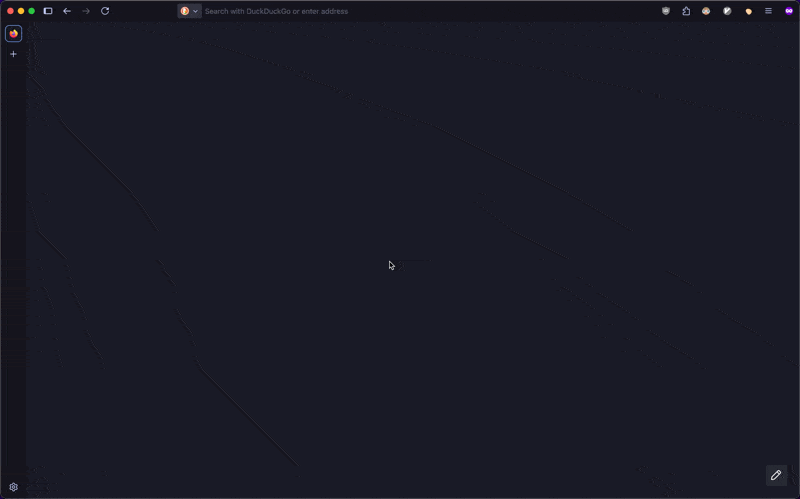

  

<h1 align="center">ZeroDistraction</h1>

  Stay focused and avoid distractions. 
  A Firefox extension that blocks distracting websites for a selected time.

  <a href="https://addons.mozilla.org/en-US/firefox/addon/zerodistraction/">Firefox Extension</a> ·
  <a href="#installation">Installation</a> ·
  <a href="#how-does-it-work">How it works</a> ·
  <a href="#contributing">Contributing</a>

## Why ZeroDistraction?

You sit down to work on something important.
You open your browser and tell yourself "just one quick check" on HackerNews or YouTube.
Three hours later, you're still scrolling, and that important task remains untouched.
We've all been there.
The internet is designed to capture and hold our attention.

**ZeroDistraction puts you back in control.**
When you need to focus, activate it for a set time period.
Try to visit a distracting site, and instead of endless feeds, you see a simple timer counting down.
It's about creating intentional breaks from distraction when you need to get things done.

## How does it work?

* Select a duration, press *Start* and get things done
* Ships with categorized presets to block (social media, news, entertainment)
* Blocked sites show a simple countdown instead of their content
* Configure exceptions of URLs that remain accessible even during focus sessions
* Configure additional URLs to block that are not yet part of the presets

## Installation

The easiest way is to [navigate to the extension page on addons.mozilla.org and click on **Add to Firefox**.](https://addons.mozilla.org/en-US/firefox/addon/zerodistraction/)

Alternatively, you can downlaod and manually install the extension.

* [Navigate to the Releases.](https://github.com/jsattler/zerodistraction/releases)
* In the Release Assets, download the `zerodistraction-extension.zip`.
* [Follow the instructions to manually install an extension.](https://developer.mozilla.org/en-US/docs/Mozilla/Add-ons/WebExtensions/Your_first_WebExtension#installing)

## URL Pattern Matching

ZeroDistraction uses simplified patterns based on the [URLPatternAPI](https://developer.mozilla.org/en-US/docs/Web/API/URL_Pattern_API)
- if you don't specify the scheme, subdomain or path, it matches all variants.

| Pattern | Matches |
|---------|--------|
| `youtube.com` | All YouTube URLs (any subdomain, scheme, path) |
| `https://youtube.com` | Only HTTPS YouTube |
| `www.youtube.com` | Only www subdomain |
| `youtube.com/shorts` | YouTube Shorts on any subdomain |

**Exceptions override blocklists:**
- Blocklist: `facebook.com` (blocks all Facebook)
- Exception: `work.facebook.com` (allows work Facebook)
- Result: `work.facebook.com` accessible, `www.facebook.com` blocked

## Similar Extensions

* [**LeechBlockNG**](https://addons.mozilla.org/en-US/firefox/addon/leechblock-ng/): Very mature, feature-rich and customizable extension.
  * **What kept me from using it?** I wanted something simpler, cleaner and without the need for extensive configuration.
  I don't want to bother reading through long documentation and spend half a day just to get started.
  I just want to select a time period and get started - easy as that.

## Privacy and Data Protection

ZeroDistraction respects your privacy and protects your data:

**Why does the extension need permissions?**
* **Access to web requests**: Required to detect and block the URLs from the block lists
* **Storage permission**: Stores your settings (timer duration, blocklists, allowlist) locally on your device only

**Your data stays private:**
* **Zero data collection**: We don't collect, store, or analyze any of your browsing data
* **No external connections**: The extension never sends any information to external servers or third parties
* **Local storage only**: All your settings and preferences remain on your device

## Disclaimer

I'm not an expert in web technologies and heavily relied on Claude to create this extension.
There are no tests yet and probably a lot of bugs. 
I just wanted something working, in a short period of time.
Next step is to make it nice and clean and add some tests.

## Contributing

Contributions are welcome! Please open an issue first to discuss what you would like to change before submitting a pull request.
If you want to add a URL to one of the blocklists, feel free to directly open a PR without opening an issue.

## License

This project is licensed under the MIT License - see the [LICENSE](LICENSE) file for details.
